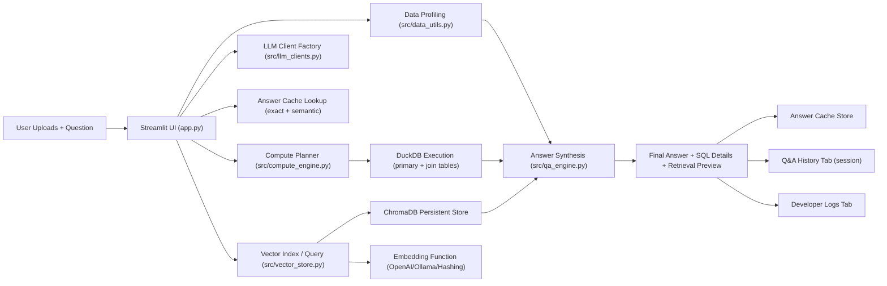

# Data Explorer QA

Streamlit-based data exploration and natural-language analytics app with a hybrid answer engine:

- Compute path: LLM plans SQL and DuckDB executes it on uploaded tables.
- Retrieval path: ChromaDB retrieves relevant indexed dataset rows.
- Synthesis path: LLM combines compute output + retrieval + schema/dictionary context into the final answer.

Python target: `3.12.x`

## 1. What You Get

- Upload one primary dataset (`csv`, `xlsx/xls`, `json`, `parquet`)
- Upload multiple additional tables for SQL joins
- Upload optional data dictionary / join-key file for RAG + planning context
- Dataset metrics and profiling dashboard
- Natural-language Q&A with compute and/or RAG toggles
- Automatic chart + table output when a visualization-style question is asked
- Computed result table shown directly in Q&A output for easier review
- Answer text standardized to `Top Insights` + `Key Takeaway` format
- LLM diagnostic reasoning summary for each answer (for troubleshooting)
- Answer feedback capture with thumbs up/down
- Two-level answer cache (exact + optional semantic matching) to reduce repeated model calls
- Runtime mode switch:
  - `local` (Ollama chat)
  - `cloud` (OpenAI chat)
- Embedding backend switch independent from chat model:
  - `openai`
  - `ollama`
  - `hashing` (fully local)
- Developer observability:
  - Rotating logs (`logs/app.log`)
  - Separate feedback log (`logs/feedback.jsonl` by default)
  - In-app `Developer Logs` tab
  - In-app `Q&A History` tab for current session

## 2. Architecture



## 3. Setup From Scratch

### Prerequisites

- Python `3.12` installed
- `pip` available
- Optional for local chat/embeddings: Ollama running at `http://localhost:11434`

### Install

```bash
cd $HOME/Documents/Data_explorer
python3.12 -m venv .venv
source .venv/bin/activate
python -m pip install --upgrade pip
python -m pip install -e .
cp .env.example .env
```

If you plan to use local Ollama models:

```bash
ollama pull llama3.1
ollama pull mxbai-embed-large
```

## 4. Start The App

Primary one-command launcher (runs tests first, then starts Streamlit):

```bash
data-explorer
```

Useful variants:

```bash
data-explorer -- --server.port 8502
```

```bash
data-explorer --skip-tests
```

Direct Streamlit run (if needed):

```bash
python -m streamlit run app.py
```

## 5. Demo Data (3-file Join Scenario)

Use these sample assets:

- `samples/sales_fact_transactions_10k.csv` (main fact table, 10,000 rows)
- `samples/sales_dim_customers.csv` (customer dimension)
- `samples/sales_dim_products.csv` (product dimension)
- `samples/sales_data_dictionary.md` (dictionary + join keys)

Suggested upload order in UI:

1. Upload fact file as primary dataset
2. Upload both dimension files as additional tables
3. Upload dictionary markdown file
4. Click `Build / Refresh QA Index`
5. Ask join-heavy questions

## 6. Question Flow Through The System

1. User asks a question in `Q&A Agent` tab.
2. App builds schema context for primary + additional tables.
3. Compute path (if enabled):
   - LLM generates SQL from question + schema + dictionary context.
   - DuckDB executes SQL against `data` plus uploaded join tables.
4. RAG path (if enabled):
   - ChromaDB retrieves relevant indexed row documents.
5. Synthesis:
   - Final LLM call combines compute output + retrieved docs + schema context.
6. Outputs:
   - Answer panel
   - LLM reasoning summary panel
   - Thumbs up/down feedback capture
   - SQL details and retrieval preview
   - Session entry recorded in `Q&A History`
   - Progress and outcomes logged in `logs/app.log`
   - Feedback events appended to `logs/feedback.jsonl`

## 6.1 Q&A Cache Behavior

- Cache scope:
  - Single-user Streamlit session
  - Context-aware (dataset, join files, dictionary file, runtime mode, embedding mode, and query-path settings)
- Match order:
  1. Exact normalized question match
  2. Optional semantic embedding similarity match (threshold-controlled)
- Cache hit result:
  - Reuses prior answer/diagnostics/details
  - Skips answer-generation LLM call
- Controls in sidebar:
  - `Enable answer cache`
  - `Enable semantic cache matching`
  - `Semantic cache threshold`
  - `Max cached answers`

## 7. Runtime Configuration

Environment variables are defined in `.env.example`.

- `OPENAI_API_KEY`
- `OPENAI_MODEL` (default `gpt-4o-mini`)
- `OPENAI_EMBEDDING_MODEL` (default `text-embedding-3-small`)
- `OLLAMA_BASE_URL` (default `http://localhost:11434`)
- `OLLAMA_MODEL` (default `llama3.1`)
- `OLLAMA_EMBEDDING_MODEL` (default `mxbai-embed-large`)
- `HASHING_EMBEDDING_DIMENSIONS` (default `512`)
- `LOG_DIR` (default `logs`)
- `FEEDBACK_LOG_FILE` (default `logs/feedback.jsonl`)
- `CHROMA_DIR` (default `chroma_db`)
- `CHROMA_COLLECTION` (default `dataset_rows`)

## 8. Codebase Map And Interactions

### Core application

- `app.py`
  - Streamlit UI and session state
  - File uploads (primary + multi-table joins + dictionary)
  - Index build / retrieval controls
  - Compute/RAG orchestration
  - Query progress UI
  - Q&A history tab and developer logs tab
  - LLM diagnostics display + answer feedback controls

### Engines and data services

- `src/compute_engine.py`
  - SQL prompt generation and extraction
  - SQL safety validation
  - DuckDB execution on primary + additional tables
- `src/cache_utils.py`
  - Question normalization and cosine similarity helpers for answer-cache matching
- `src/vector_store.py`
  - Chroma client/collection management
  - Embedding adapters (OpenAI/Ollama/Hashing)
  - Document indexing and retrieval
  - Adaptive add batching to respect Chroma max batch size
- `src/qa_engine.py`
  - Final answer synthesis prompt and output
- `src/data_utils.py`
  - Dataset loading/parsing
  - Schema and overview summaries
  - Retrieval preview builder
  - Document-batch conversion for indexing
- `src/llm_clients.py`
  - OpenAI/Ollama chat client wrappers
- `src/logging_utils.py`
  - Logger setup, log tail utility, and JSONL feedback writer
- `src/config.py`
  - Environment-backed runtime config object

### Packaging and launch

- `data_explorer/cli.py`
  - `data-explorer` command
  - Enforces Python 3.12
  - Runs test suite before app launch
- `pyproject.toml`
  - Package metadata, dependencies, console script entrypoint

### Tests

- `tests/test_compute_engine.py`
- `tests/test_answer_format_utils.py`
- `tests/test_cache_utils.py`
- `tests/test_data_utils.py`
- `tests/test_qa_engine.py`
- `tests/test_logging_utils.py`
- `tests/test_vector_store.py`

These validate SQL safety/extraction/execution, ingestion/profile helpers, and vector indexing/retrieval behavior.

## 9. Testing And Quality Gates

Run full unit tests:

```bash
python3.12 -m unittest discover -s tests -p 'test_*.py' -v
```

Optional compile sanity check:

```bash
python3.12 -m compileall app.py src data_explorer tests
```

The `data-explorer` launcher runs tests automatically unless `--skip-tests` is provided.

## 10. Single-User / Scale Notes

- Current mode is optimized for single-user sessions.
- UI index controls support up to 1,000,000 indexed rows.
- Dashboard visualizations use sampled subsets for responsiveness.
- Chroma ingestion auto-chunks batches to the backend max batch size.

## 11. Troubleshooting

- `RAG index is not built...`
  - Rebuild index after changing runtime or embedding settings.
- `LLM configuration failed`
  - Verify API key/model (cloud) or Ollama URL/model (local).
- `Batch size ... greater than max batch size ...`
  - Resolved in current build via adaptive batching; update/restart app if seen from older process.
- Empty or weak answers
  - Upload dictionary/join-key file, verify compute/RAG toggles, and ask narrower prompts.
- Feedback log not updating
  - Confirm write permissions for `FEEDBACK_LOG_FILE` path and submit thumbs up/down on an answered question.

